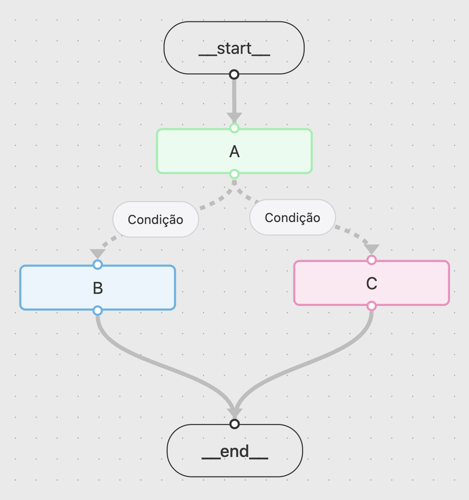

## Intro to langGraph

LangChain offers tools for working with LLMs in general. We can use it in various parts of our code, however, when we need to deal with more complex data flows, LangGraph makes everything much simpler and more organized.

### How does LangGraph work?

Instead of chaining calls in a rigid way, in LangGraph we work in the **graph** (_graph_) format. This means that we have **nodes** (_nodes_) connected by **edges** (_edges_).
  - **Nodes** - functions that perform an action (they can call an LLM or just run code). 
  - **Edges** - determine which node will be executed next.   
    - They can be **conditional** (_conditional edges_), pointing to different nodes depending on a condition.  

Another important point: LangGraph graphs work with **state**. Each node receives the state as input and can return the updated state.  

Example of a simple graph:

### The minimum necessary to create a graph in LangGraph
- **State** - defines the state of the graph (it can be a `TypedDict`, a `dataclass` or a `Pydantic` model).
- **Nodes** - functions that receive the state as input, perform actions and return the updated state.
- **Edges** - connections between nodes, which can be simple or conditional.

Code [example](../src/examples/003)
